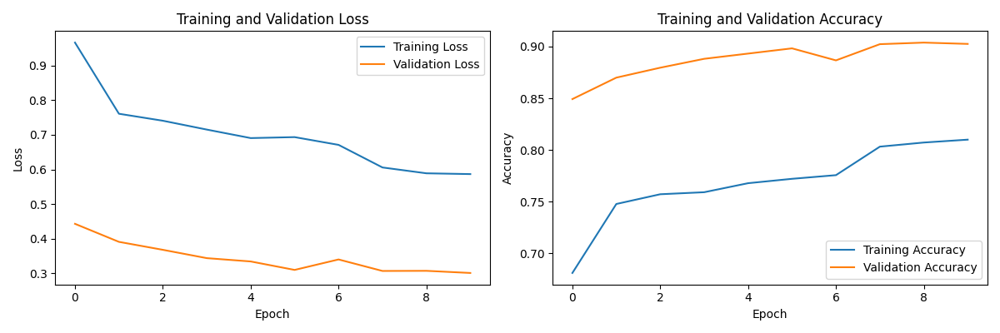
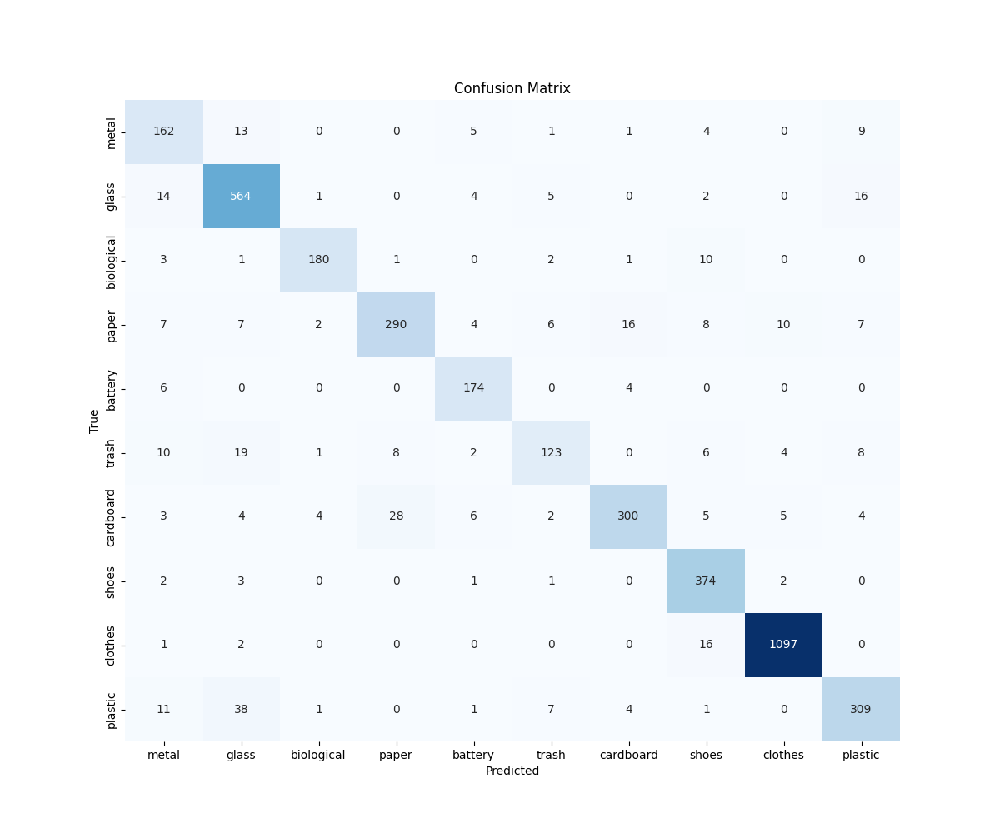
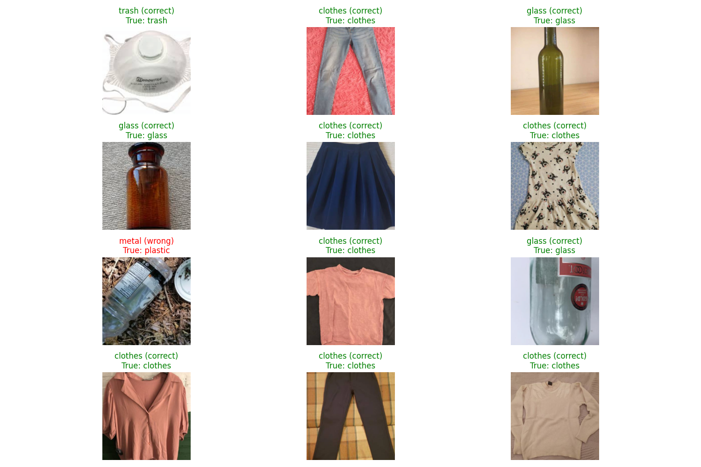

# Garbage Classification with ResNet50

This project implements an advanced image classification system designed to identify and categorize various types of garbage items. Using deep learning techniques and computer vision, the system can automatically classify waste materials into distinct categories, supporting more efficient recycling processes and waste management systems.

The implementation leverages transfer learning with the ResNet50 architecture, a powerful convolutional neural network pre-trained on the ImageNet dataset. By fine-tuning this model on a specialized garbage dataset, we achieve high classification accuracy while minimizing training time and computational requirements.

### Key Features

- **Multi-class Garbage Classification**: Accurately identifies different types of waste materials
- **Transfer Learning**: Utilizes pre-trained ResNet50 model to achieve better performance with less data
- **Data Augmentation**: Implements various transformations to improve model generalization
- **Comprehensive Evaluation**: Includes detailed metrics, confusion matrices, and visual predictions
- **Jupyter Notebook Implementation**: Complete reproducible workflow in a single notebook

### Applications

This system has practical applications in:
- Automated recycling facilities
- Smart trash bins
- Waste sorting education
- Environmental monitoring
- Recycling compliance verification

By automating the classification of garbage items, this project contributes to more efficient recycling processes, reduced contamination in recycling streams, and ultimately, more sustainable waste management practices.

## Implementation Steps

1. **Data Preparation**
   - Loading and preprocessing of garbage images
   - Splitting data into training and validation sets
   - Data augmentation to improve model generalization

2. **Model Architecture**
   - Using pre-trained ResNet50 as a feature extractor
   - Adding custom classification layers for our specific classes
   - Fine-tuning the model for garbage classification

3. **Training Process**
   - Transfer learning approach with pre-trained weights
   - Fine-tuning with our garbage dataset
   - Training with appropriate loss function and optimizer

4. **Evaluation & Results**
   - Model performance metrics
   - Confusion matrix analysis
   - Sample predictions visualization

## Results

### Training History

The graph below shows the training and validation accuracy/loss over epochs:

### Confusion Matrix

The confusion matrix shows the performance of the classification model for each category:

### Model Predictions

Sample predictions from the model on test images:

## Usage

1. Clone this repository
2. Set up the required environment (Python 3.x with PyTorch)
3. Prepare your dataset in the required format
4. Run the notebook `garbage-classification-with-resnet50.ipynb`

## Requirements

- Python 3.x
- PyTorch
- torchvision
- Matplotlib
- NumPy
- Pandas
- scikit-learn

## Future Improvements

- Implement real-time classification using webcam input
- Expand the dataset to include more categories
- Deploy the model on edge devices for real-world applications
- Explore model quantization for better performance on resource-constrained devices

## Acknowledgements

- The ResNet architecture was introduced by He et al. in ["Deep Residual Learning for Image Recognition"](https://arxiv.org/abs/1512.03385)
